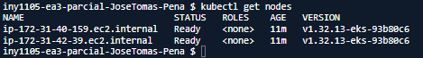
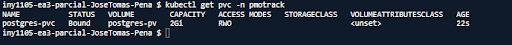
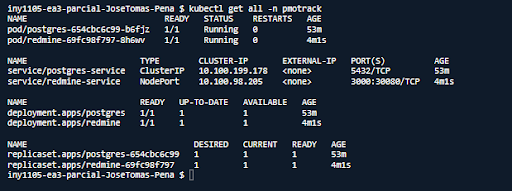
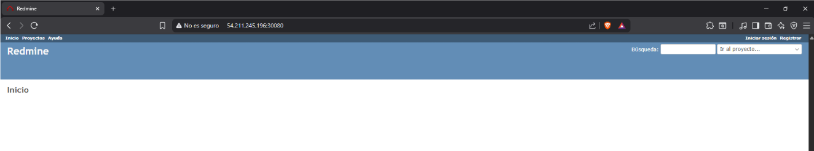
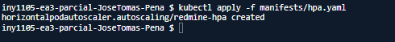
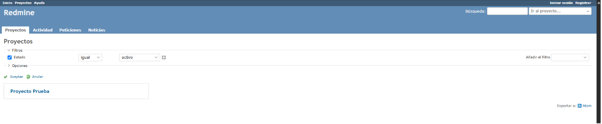

# Evaluación Parcial N°3 - Caso PMOTrack

**Autor:** José Tomás Peña Sandoval
**Asignatura:** Tecnologías de Virtualización 002V

## 1. ¿De qué trata esta arquitectura?
Para este trabajo, armé una aplicación web dividida en dos partes dentro de un clúster de Kubernetes en AWS (EKS):
* **Frontend:** Usé Redmine. Lo dejé expuesto para poder entrar desde el navegador y le configuré autoescalado para que soporte más tráfico si es necesario.
* **Backend:** Usé una base de datos PostgreSQL. Esta parte está "escondida" y solo se comunica de forma interna con el frontend por seguridad.
* **Almacenamiento:** Para no perder los datos si se cae un Pod o se reinicia algo, le conecté un disco duro virtual (Persistent Volume).

## 2. Decisiones Técnicas que tomé
* **Las Imágenes:** Elegí las versiones `redmine:5` y `postgres:16` para ir a la segura con la compatibilidad.
* **Redes (Services):** Al frontend le puse un Service tipo `NodePort` (en el puerto 30080) para poder acceder por la web. A la base de datos le puse un `ClusterIP` para mantenerla privada y aislada de internet.
* **Los Datos:** Usé un volumen `hostPath` de 2Gi. Haciendo pruebas, me di cuenta que al borrar el Pod, la base de datos podía levantarse en otro nodo distinto y "perder" los datos. Para solucionar esto, le agregué un `nodeSelector` a mi YAML. Así obligué a la base de datos a nacer siempre en el mismo servidor y la persistencia funcionó perfecto.
* **Autoescalado (HPA):** Le configuré un HPA al frontend para que escale entre 1 y 5 réplicas si el consumo de CPU pasa del 50% (le definí un límite de 250m de CPU base).

## 3. Pasos para levantar este proyecto
Si quieres probar esta configuración, sigue estos pasos:
1. Clona este repo y corre `bash commons/scripts/setup-cloudshell.sh`.
2. Levanta el clúster ejecutando `bash commons/scripts/create-cluster.sh`.
3. Crea el espacio de trabajo: `kubectl create namespace pmotrack`.
4. Aplica los manifiestos YAML en este orden:
   - `kubectl apply -f manifests/postgres.yaml`
   - `kubectl apply -f manifests/redmine.yaml`
   - `kubectl apply -f manifests/hpa.yaml`
5. Abre el puerto en el firewall de AWS: `bash commons/scripts/open-nodeport.sh 30080`.
6. Entra a la IP pública del nodo en el navegador (puerto 30080) y listo.

## 4. Evidencias del funcionamiento
* **Clúster activo:** 
* **PVC en estado Bound:** 
* **Objetos del namespace:** 
* **Redmine en el navegador:** 
* **Autoscaling bajo carga:** 
* **Persistencia de datos tras recrear el Pod:** 
